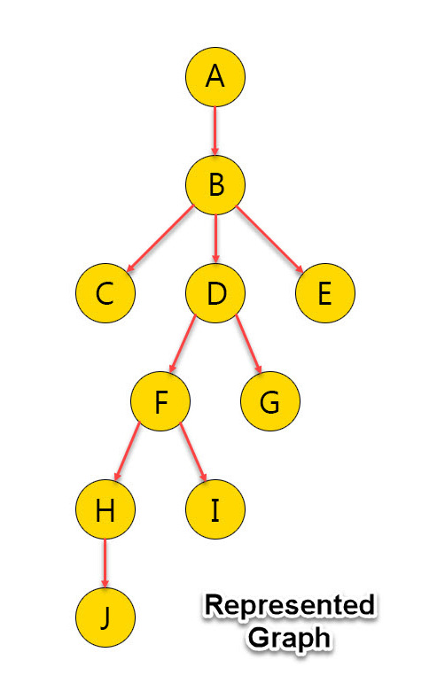

# graph

### An example of building a tree structure graph in Java

***Description:***

This example shows a graph with objects built on the principle of nodes 
and a way to bypass this graph and find the shortest path along all branches.

***How to use:***

Create the "Main" class run configuration in your IDE and start the program.

***Tools used:***

Java  
Maven  
